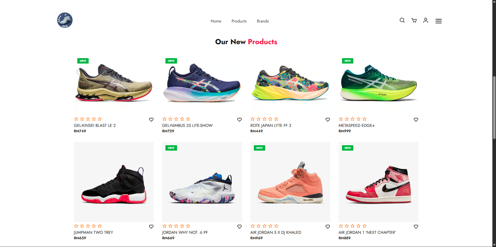

# Sports Shoe E-Commerce Website

A full-featured online shopping platform for sports shoes built with PHP, MySQL, HTML, CSS, and JavaScript. This e-commerce website provides a complete shopping experience with user authentication, product browsing, shopping cart functionality, and an admin dashboard for inventory management.

## Screenshots

### Homepage


### Products Page


## Features

### Customer Features
- **User Authentication**
  - User registration and login system
  - Secure password handling
  - Member profile management

- **Product Browsing**
  - Browse sports shoes from various brands (ASICS, Jordan, PUMA)
  - View detailed product information
  - Product ratings and reviews
  - Wishlist functionality (heart icon)

- **Shopping Cart**
  - Add products to cart
  - Update quantities
  - Remove items
  - Real-time cart updates

- **Checkout Process**
  - Secure checkout flow
  - Payment processing
  - Order confirmation

### Admin Features
- **Admin Dashboard**
  - Product management (add, edit, delete)
  - Order management
  - Customer management
  - Inventory tracking

- **Product Management**
  - Upload product images
  - Set pricing and descriptions
  - Manage product categories

## Technology Stack

- **Frontend**
  - HTML5
  - CSS3
  - JavaScript
  - Boxicons
  - Font Awesome
  - Google Fonts (Jost)

- **Backend**
  - PHP
  - MySQL Database
  - AJAX for asynchronous requests

- **Server**
  - XAMPP (Apache + MySQL)

## Project Structure

```
shopping-cart/
├── index.php              # Homepage
├── products.php           # Products listing page
├── cart.php              # Shopping cart page
├── checkout.php          # Checkout page
├── payment page.php      # Payment processing
├── success.php           # Order success page
├── Login.php             # User login
├── Register.php          # User registration
├── admin.php             # Admin login
├── adminpage.php         # Admin dashboard
├── adminHeader.php       # Admin navigation
├── sidebar.php           # Admin sidebar
├── viewAllProducts.php   # Admin product management
├── viewAllOrders.php     # Admin order management
├── viewCustomers.php     # Admin customer management
├── config.php            # Database configuration
├── header.php            # Customer site header
├── member profile.html   # User profile page
├── style.css             # Main stylesheet
├── Style homepage.css    # Homepage styles
├── Style login.css       # Login page styles
├── Style register.css    # Registration page styles
├── styleadmin.css        # Admin panel styles
├── script.js             # Main JavaScript
├── scriptadmin.js        # Admin JavaScript
├── ajaxWork.js           # AJAX functionality
├── images/               # Product images
├── uploaded_img/         # User uploaded images
├── member profile image/ # Profile pictures
└── screenshots/          # Documentation screenshots
```

## Installation

### Prerequisites
- XAMPP (or any Apache + MySQL + PHP environment)
- Web browser
- Git (for cloning the repository)

### Setup Instructions

1. **Clone the Repository**
   ```bash
   git clone https://github.com/yourusername/sports-shoe-ecommerce.git
   ```

2. **Move to XAMPP Directory**
   ```bash
   # Move the project to your XAMPP htdocs folder
   # Example: C:\xampp\htdocs\shopping-cart
   ```

3. **Database Setup**
   - Start XAMPP Control Panel
   - Start Apache and MySQL services
   - Open phpMyAdmin (http://localhost/phpmyadmin)
   - Create a new database (e.g., `shopping_cart`)
   - Import the database schema (if SQL file is provided)

4. **Configure Database Connection**
   - Open `config.php`
   - Update database credentials:
     ```php
     $host = 'localhost';
     $username = 'root';
     $password = '';
     $database = 'shopping_cart';
     ```

5. **Access the Website**
   - Customer site: `http://localhost/shopping-cart/index.php`
   - Admin panel: `http://localhost/shopping-cart/admin.php`

## Usage

### For Customers
1. Register for a new account or login
2. Browse products on the homepage or products page
3. Add items to your cart
4. Proceed to checkout
5. Complete payment
6. View order confirmation

### For Administrators
1. Login to admin panel
2. Manage products (add, edit, delete)
3. View and process orders
4. Manage customer accounts
5. Track inventory

## Features in Detail

### Product Catalog
- **New Arrivals Section**: Displays latest sports shoes
- **Brand Variety**: ASICS, Nike Jordan, PUMA
- **Product Information**: Name, price, ratings, images
- **Interactive UI**: Heart icons for wishlist, star ratings

### User Experience
- Responsive navigation menu
- Search functionality
- Shopping cart icon with real-time updates
- User account management
- Smooth scrolling and animations

### Admin Panel
- Comprehensive dashboard
- Product inventory management
- Order tracking system
- Customer database
- Sales analytics

## Database Structure

The application uses MySQL database with tables for:
- Users/Customers
- Products
- Orders
- Cart items
- Admin accounts

## Security Features

- Password hashing for user accounts
- SQL injection prevention
- Session management
- Admin authentication
- Secure payment processing

## Future Enhancements

- Payment gateway integration (Stripe, PayPal)
- Email notifications
- Order tracking system
- Product reviews and ratings
- Advanced search and filtering
- Responsive mobile design
- Social media integration
- Coupon and discount system

## Contributing

Contributions are welcome! Please feel free to submit a Pull Request.

## License

This project is open source and available under the [MIT License](LICENSE).

## Contact

**Developer**: Haziq, Zaid
**Email**: haziqsabri8@gmail.com
**Phone**: 011-56642943
**Address**: 10, Jalan Melor 1A/1, Rawang, Selangor

## Acknowledgments

- Product images from various sports shoe brands
- Icons from Boxicons and Font Awesome
- Fonts from Google Fonts
- Inspiration from modern e-commerce platforms

---

**Note**: This is an educational project demonstrating e-commerce functionality. For production use, additional security measures and payment gateway integration are recommended.
